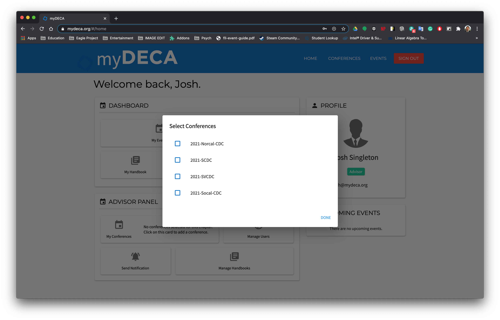
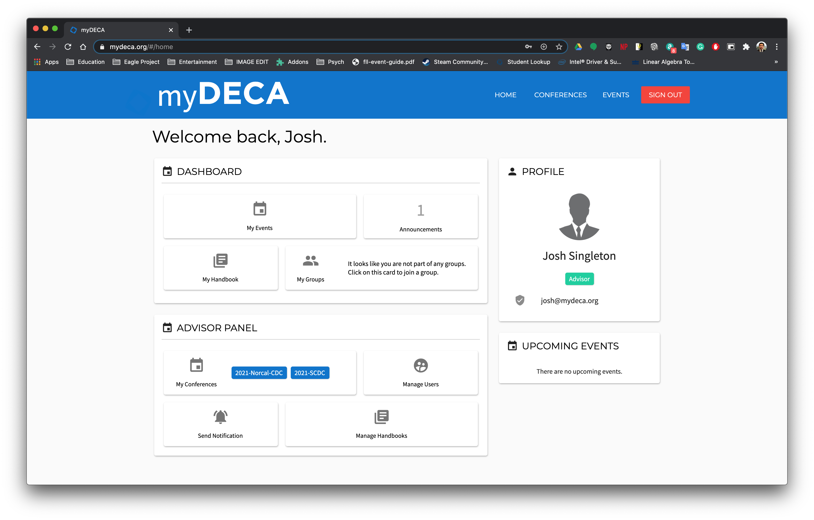

# Chapter Setup

## Select Conferences

The first thing you'll want to do as an advisor is select the conferences that your chapter will participate in. Clicking on the "My Conferences" card in the Advisor Dashboard will bring up the following menu.

Once you select the appropriate conferences, you should see the "My Conferences" card update to reflect this. The selected conferences will also show up on the Conferences page now.

## Set Meetings

The next thing you should do is set your chapter's meeting times. 

This section contains documentation for a feature that is currently in development. Content may be missing or outdated!

