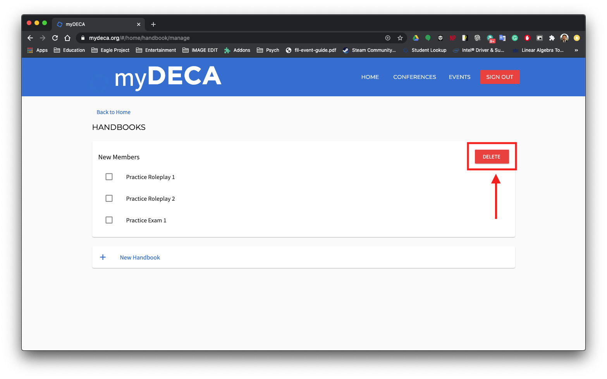
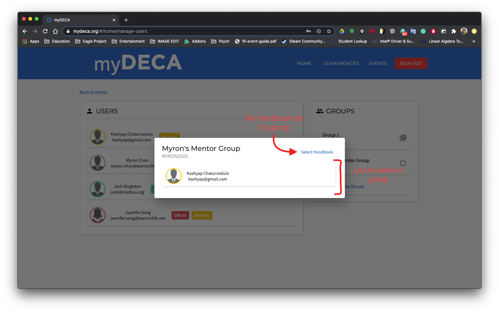

# Handbooks

Handbooks are a tool that can be used to track member progress throughout the year. Similar to the Boy Scout Handbook, you can create a list of tasks that members must complete before competing in conferences \(or for general progress tracking\). Handbooks can be assigned to a group, which will assign that handbook to all the users in the aforementioned group. Officers can then check off handbook items for members that are in their group.

## Creating a Handbook

> Minimum Role: `Advisor`

Navigate to the Handbooks page by clicking on the "Manage Handbooks" card on the dashboard. You should see a list of your current handbooks along with a button at the bottom to create a new handbook.

Click on the button and you will see a blank handbook with text fields at the very top of the handbook list. You can use the fields and buttons there to create a new handbook.

Once you are done and clicked the CREATE button, you should see your brand new handbook in the list!

## Deleting a Handbook

> Minimum Role: `Advisor`

Deleting a handbook is as easy as pressing the DELETE button at the top right of each handbook in the list!

## Adding a Handbook to Group

> Minimum Role: `President`

To add a handbook to a [group](manage-groups.md), first navigate to the "Manage Users" page. Then click on a group from the list on the right. You should be greeted with an alert that looks similar to the following.

You will see a list of users who have joined the group, as well as a "Select Handbook" button at the top. If you see a button other than "Select Handbook", it means that a handbook was previously set for that group. Clicking on this button will reveal a drop-down with a list of all the handbooks you already have created.

Just select the handbook you want to add from the list, and you should see the button update. You can also quickly check whether a group has a handbook assigned to it by looking at the icon at the end of the group card.

