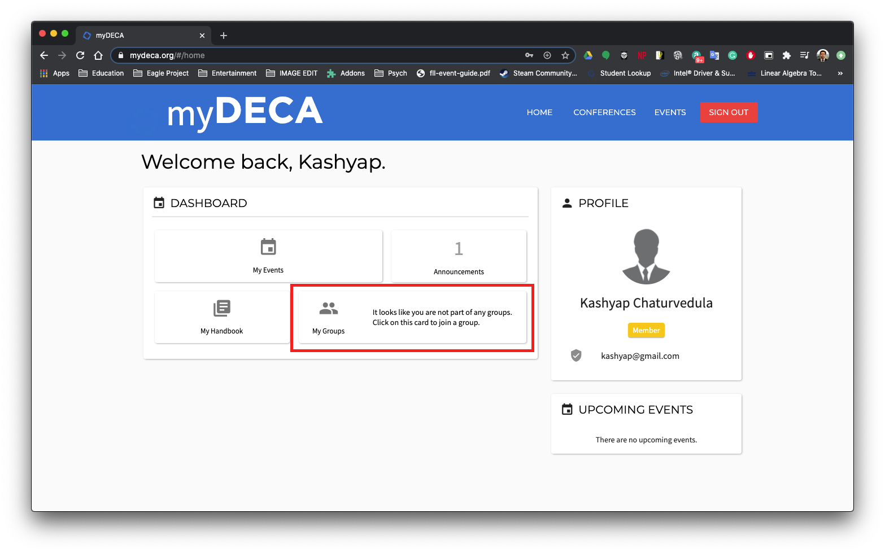
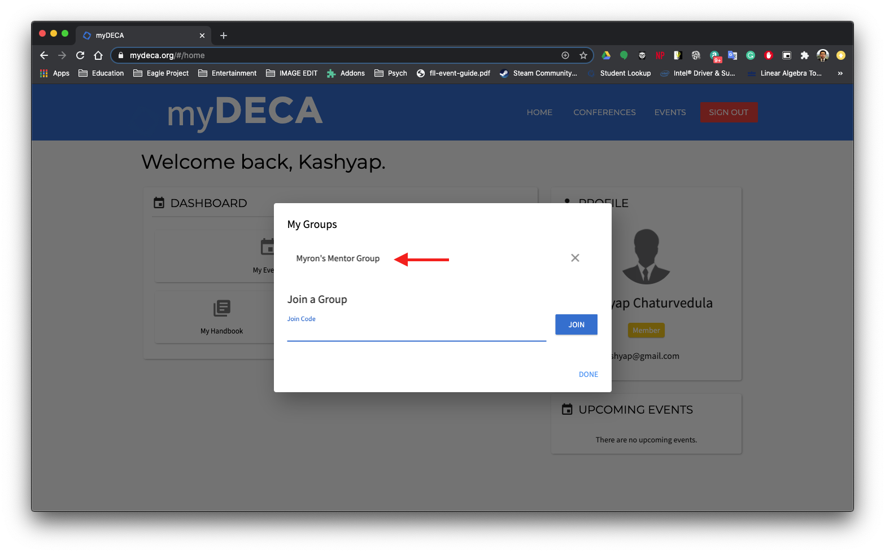
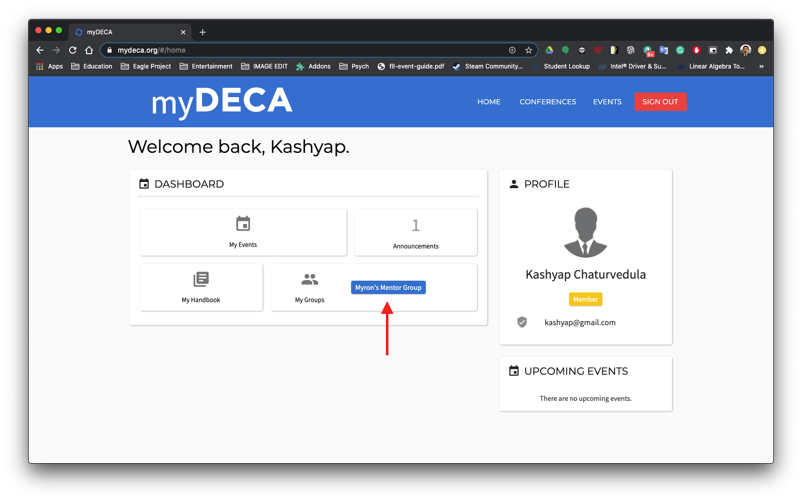
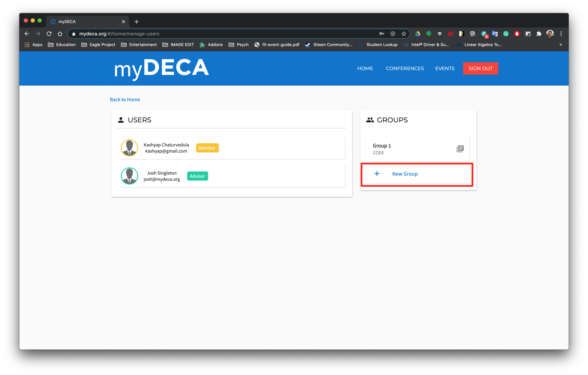
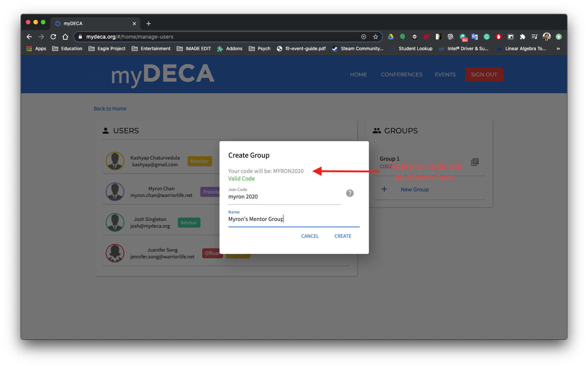
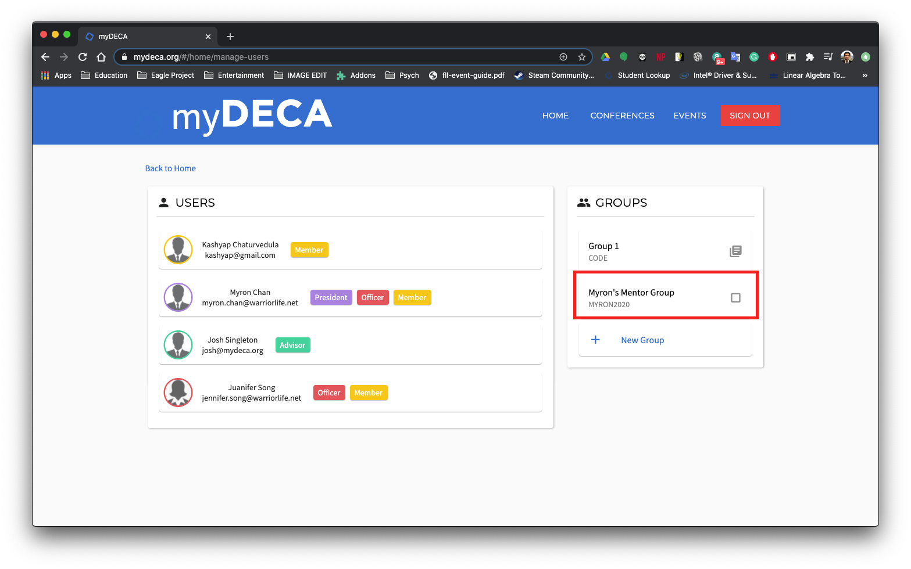
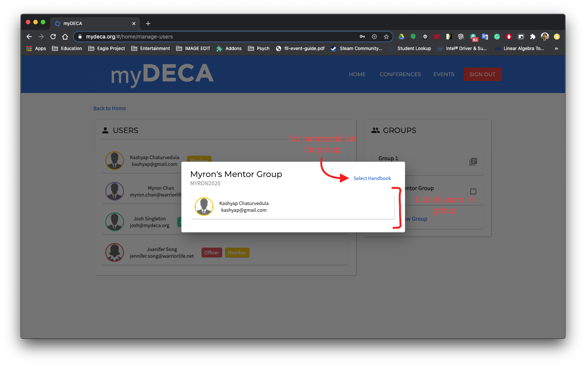
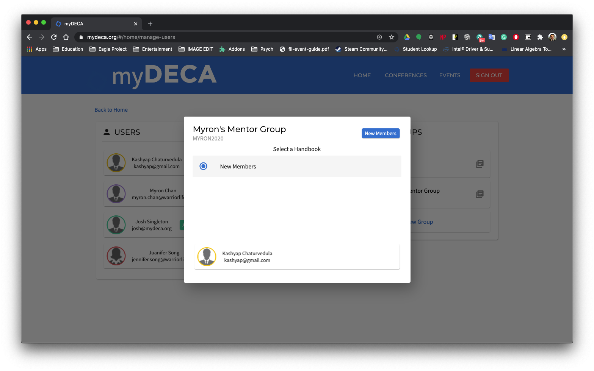
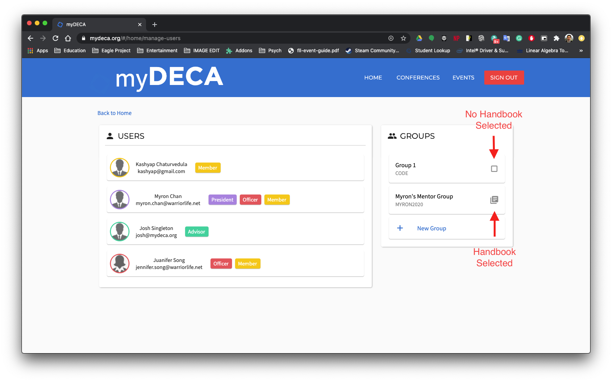

# Groups

You can create groups to seperate users based on event, mentor, chaperone, or anythign else! All groups have a join code that you set when creating the group. Join codes must be unique, capital, and not include any speical symbols. Each group also has a "friendly name" which is shown the user to help them identify which groups they are in.

## Joining a Group

To join a group, first click on the "My Groups" card on the dashboard.

You should see a dialog pop up with all the groups you have already joined listed. At the bottom of the dialog, there is a text field where you can enter the join code of a group you want to join.


Keep in mind that join codes are case sensitive, and do not have any spaces.


Once you click the JOIN button, you should see the name of the group appear under the the list of groups in the alert.

You will now be able to see the new group in your dashboard!

## Creating a Group

> Minimum Role: `President`

To create a group, the first step is to navigate to the "Manage Users" page by clicking on the "Manage Users" card in the dashboard. You should see a list of groups in the right column. At the bottom of the list, you should see a "New Group" button.

After clicking on this, you will be greeted with an alert to fill out your group details. The name of your group will be the one that is visible to all members and users can use as a "friendly name" for your group. The join code is the code that users will use to join your group \(adding a new group from the dashboard\).


Your join code will automatically be formatted without spaces, all upercase, and no special characters.


When you are done setting up your group, go ahead and click the CREATE button. You will now see your new group added to the group list in the right side column.

## Adding a Handbook to Group

> Minimum Role: `President`

To add a [handbook](handbooks.md), first click on a group from the list on the right. You should be greeted with an alert that looks similar to the following.

You will see a list of users who have joined the group, as well as a "Select Handbook" button at the top. If you see a button other than "Select Handbook", it means that a handbook was previously set for that group. Clicking on this button will reveal a drop-down with a list of all the handbooks you already have created.

Just select the handbook you want to add from the list, and you should see the button update. You can also quickly check whether a group has a handbook assigned to it by looking at the icon at the end of the group card.

