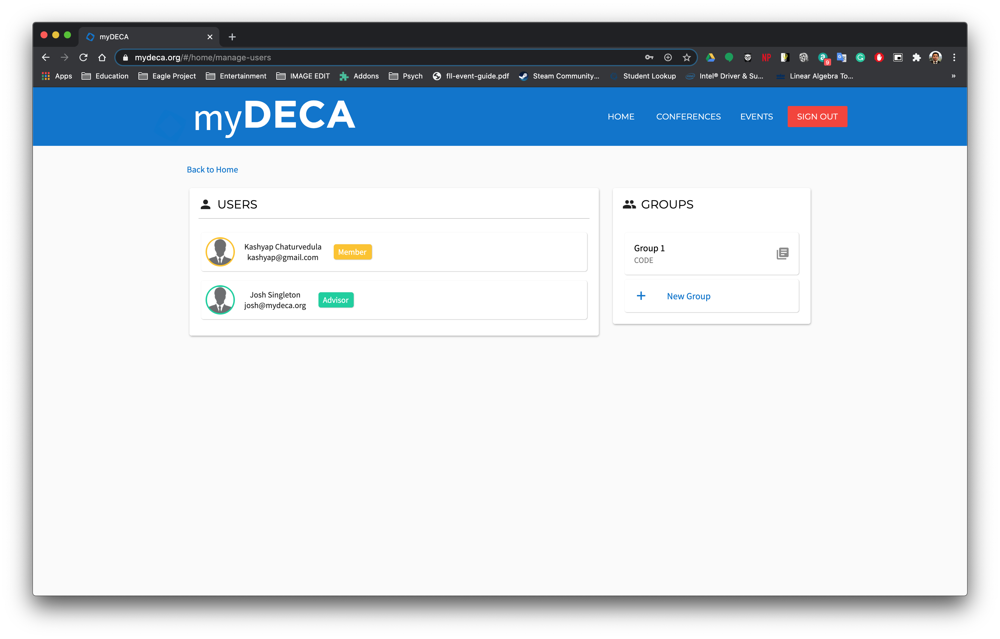
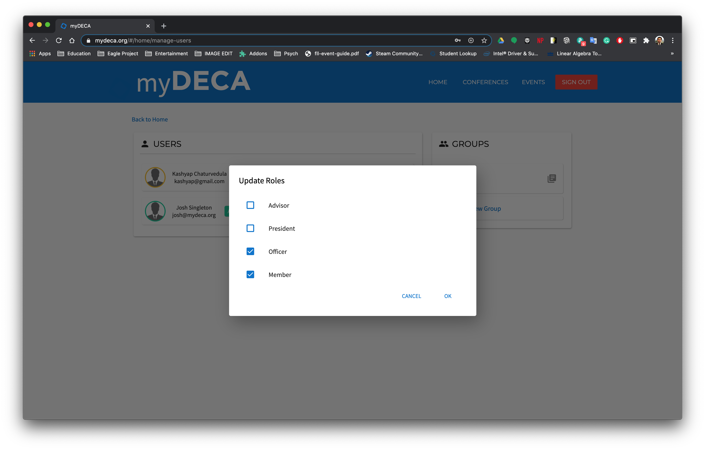
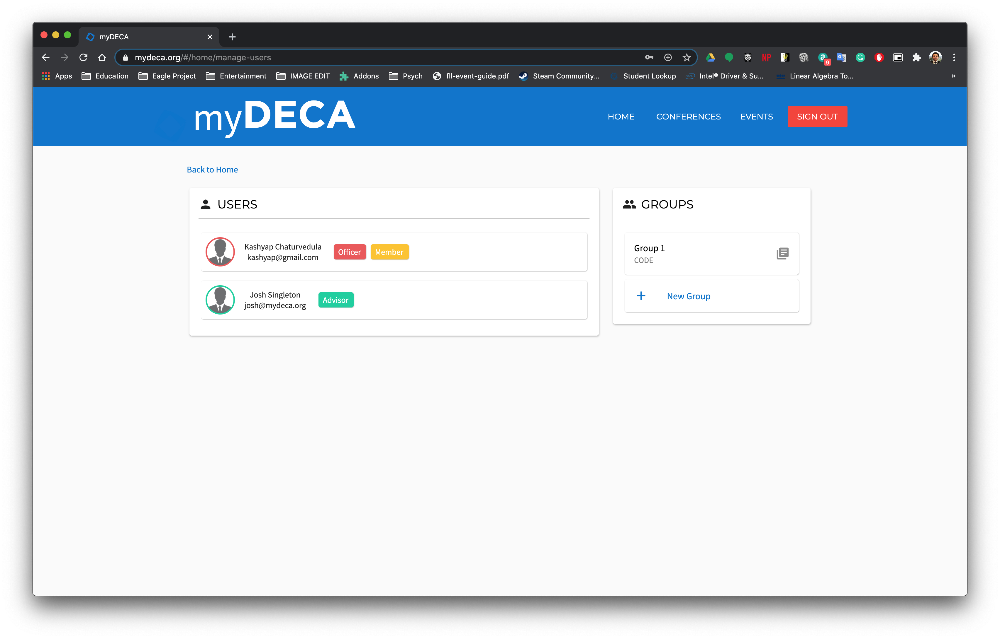

# Users

myDECA uses a role-based system to manage user access and authenticate requests. We currently have the following roles:

1. Developer
2. Advisor
3. President
4. Officer
5. Member

The role hierarchy is used to determine access to certain actions/features/content. Throughout this documentation, you will see the `Minimum Role` listed before each feature explanation. This represents the lowest role on the role hierarchy required to interact with that feature. For example, if the minimum role to access a certain feature is `Officer`, then anyone with the roles `Developer`, `Advisor`, `President`, or `Officer` will be able to access that feature.

## Editing Roles

> Minimum Role: `Officer`

 You can change a user's roles on the "Manage Users" page, which you can get to by clicking on the "Manage Users" card on the home page.

You should see two columns, one with a list of users and one with a list of groups. You can learn about groups [here](manage-groups.md), but we will stick to the users column for now.

To edit a users roles, simply click on the user's card. You will be greeted with a dialog that will allow you to add and remove roles from the selected user.

You will only be able to add/remove roles for a user if you have that role first. For example, an `Officer` cannot add the `President` to someone.

Once you click the OK button, you should see your changes reflected immediately in the user list.

