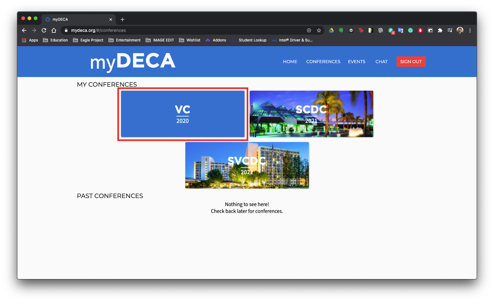
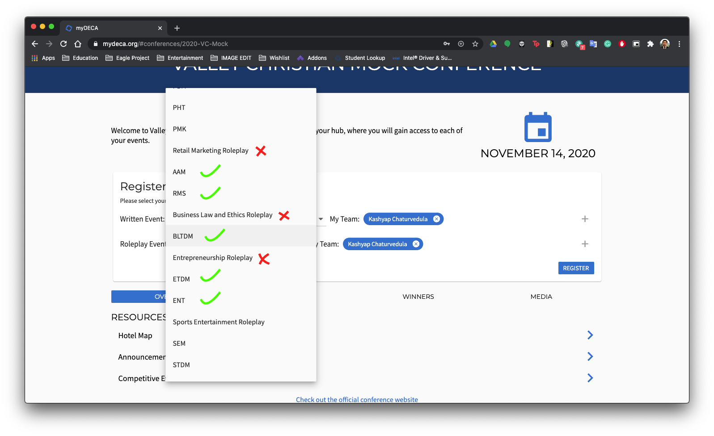
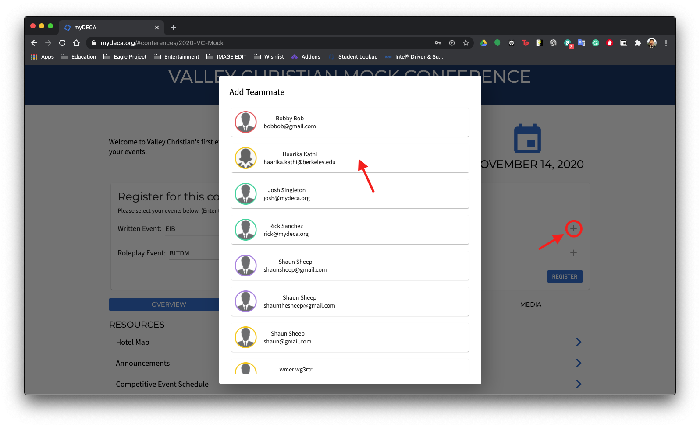
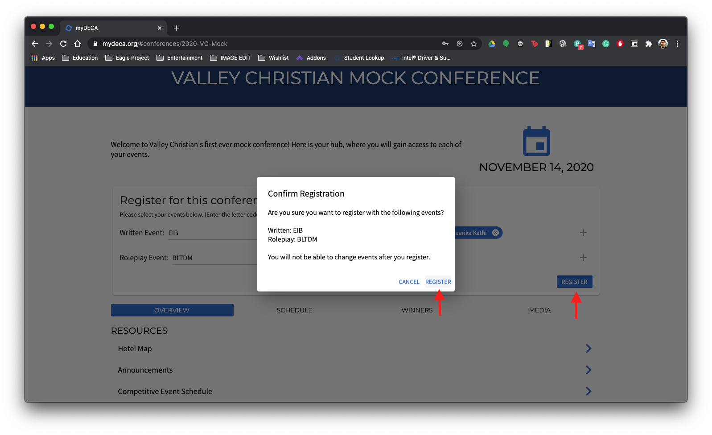
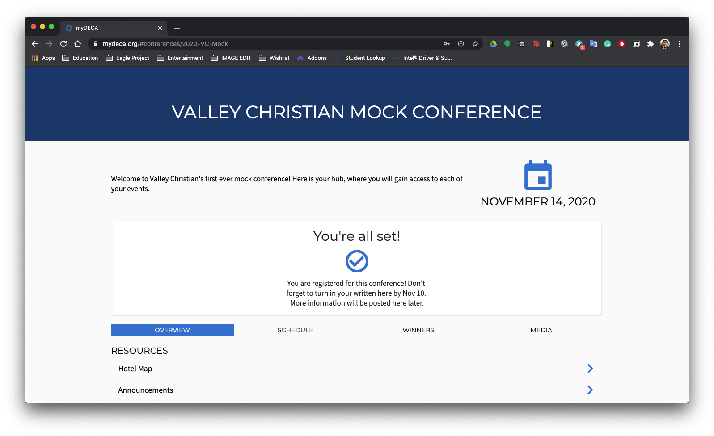
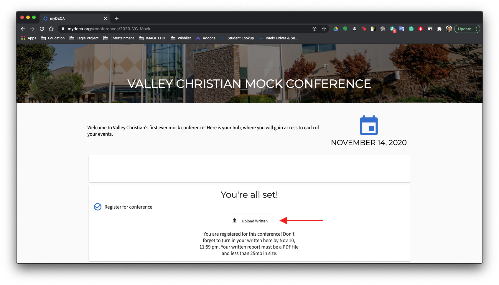
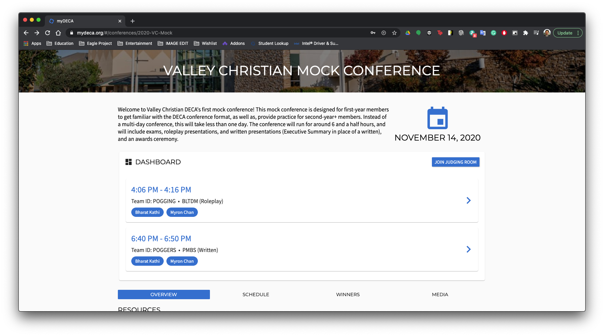
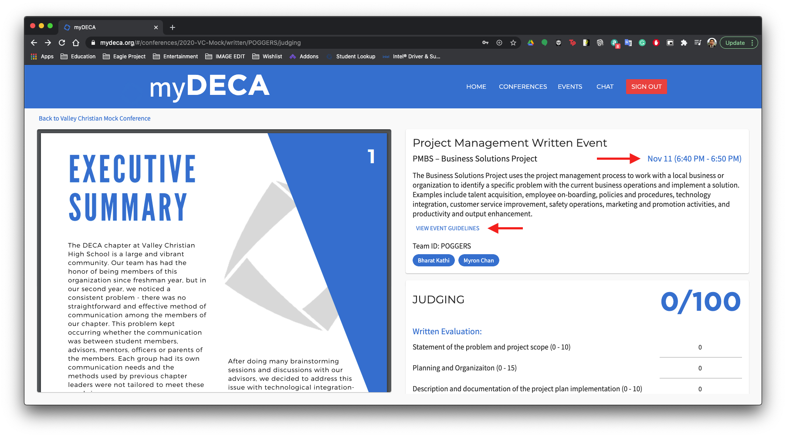

# Mock Conference

Here is the page for everything to do with mock conferences on myDECA.

## Table of Contents

* [Registration](mock-conference.md#registration)
* [Submitting a Written](mock-conference.md#submitting-a-written)
* Judging

## Registration

First, you will need to have a myDECA account. Check out the [registration guide](registration.md) for more information.

Next, navigate to the Conferences page and select the VC Mock Conference from the list of Upcoming Conferences.

Once you are on the conference page, you should see a card to register for the mock conference. You will need to select your written and roleplay events, as well as your teammates. Make sure that you are selecting a specific event \(letter codes\), and not the mock conference category. 

If you are working with a teammate, then you can add them to your written and/or roleplay using the plus button on the right. You will be greeted with a dialog listing all the other users in the chapter. Just select a teammate from this list. 


Your teammate must be registered with myDECA before you will see them in the list to add them as a teammate.


Once you have filled out all the appropriate information for the mock conference, click on the register button and confirm your registration.

Once you have registered, you should see a confirmation card on the mock conference page. You're all set!

## Submitting a Written

To submit a written, go to the mock conference page. You should see a button to upload your report. 

Once you select your written report from the menu, you will see a loading indicator to show you that it is uploading to our servers. Once the report has been successfully uploaded, you will see the status update on the page.


Don't forget to make sure that you are submitting a PDF file and it is less than 25mb in size. Any other files will not be uploaded!


You can edit this submission anytime up until the final deadline of November 10, 11:59 pm \(PST\). Any new submissions will overwrite the current one.

## Judging

Here is an overview of mock conference judging, and how everything will work. Judges will be provided with an email and password login to gain access to the judging portal on the mock conference page.

You will see the list of teams that you are judging on the dashaboard. You will also see whether that team is a written or a roleplay, along with which event that team is competing in. Click on a team to go to the judging page for that team.

### Written Judging

Once, you go to the written judging page for a team, you should see something like the following.

On the left, you will see the written report that team has submitted. On the right, you will see that teams's event, event description, and judging time. There is a button that will take you to the official DECA Event Guidelines for that event so you can get some more information about what the event is about and what is required for it. You can also see the team's ID and members listed.


Some written events do not require an actual written report to be submitted such as the Professional Selling Events.


Below that, you will see a judging card. This is where you will input scores for that team. It is split into 2 sections, Written Evaluation and Presentation Evaluation. We recccomend that you take some time to looks through  

