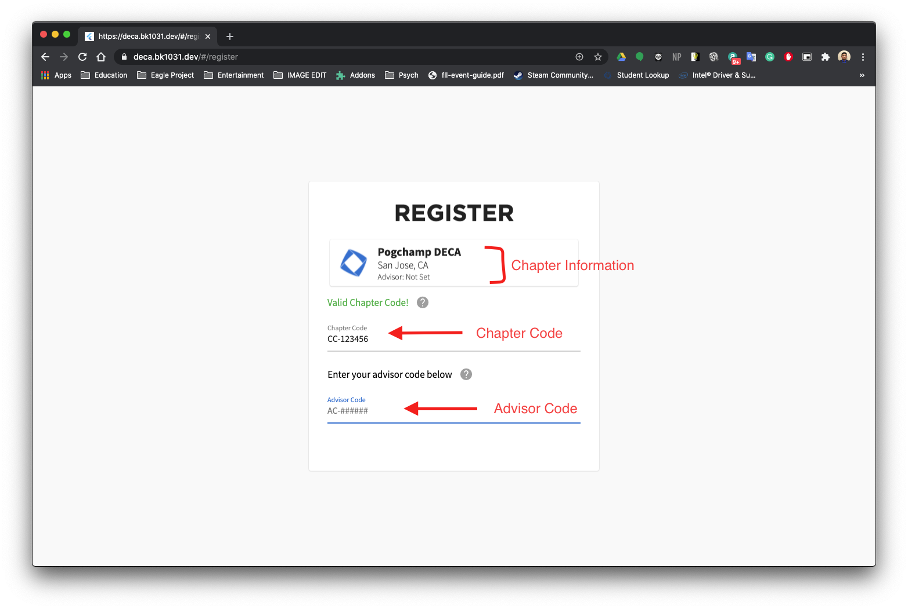
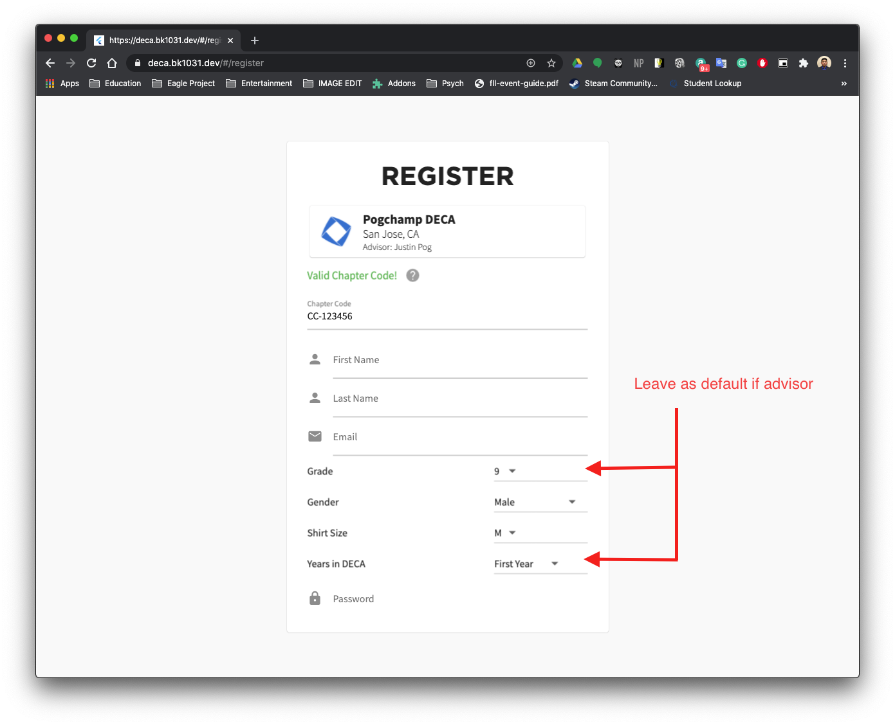
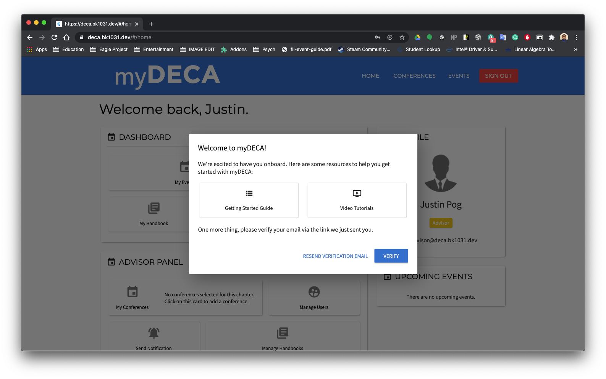
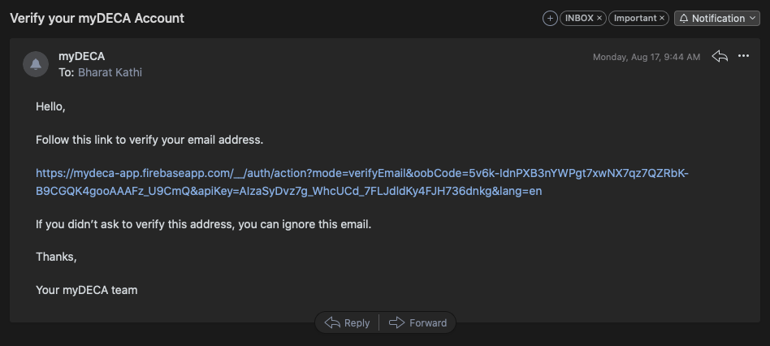

# Registration

## Creating your Account

Each DECA chapter is given a code. This code is used to identify your chapter throughout myDECA. Chapter Codes follow this format:

```text
CC-######

Ex. CC-123456
```

Head on over to the [Registration Page](https://deca.bk1031.dev/#/register) and enter in your chapter code.



If you are prompted for an advisor code, then that means no advisor has joined your chapter yet. For security reasons, we request that an advisor creates their myDECA account before inviting chapter members to do so.



If you are an advisor, feel free to leave the fields in the screenshot above as they are.

## Email Verification

For security reasons, we also ask that all users verify their email addresses before gaining access to the platform.



You should recieve an email that looks like the screenshot below.



Just click the link, which should take to a page that says your account has been verified. You can then close the tab, and return back to the myDECA page. Click the VERIFY button and the page should reload.

_Hint: You might have to click the VERIFY button again if it doesn't work the first time_

## Next Steps

If you are an advisor, check out this [Chapter Setup Guide](registration.md).

If you are a member, check out this [Chapter Member Guide](registration.md).

