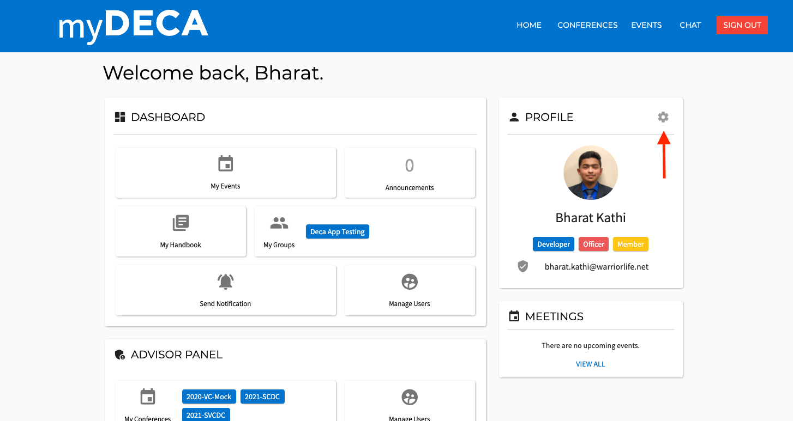
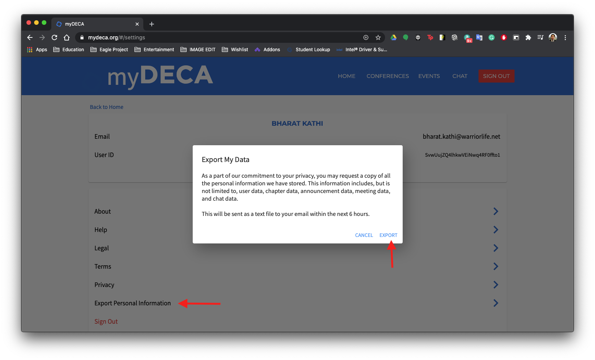
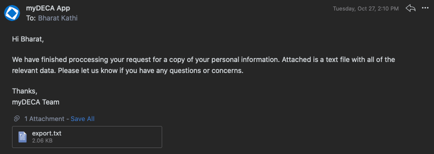

# Settings

Here is a quick walkthrough of all the settings on myDECA. To access the settings page, simply click on the cog icon next to your profile on the home page.

If you are on mobile, you can find a settings tab on the far right of the bottom navigation bar.

### 

### Export Personal Information

You can request a copy of your personal information using this dialog.

You will receive an email with a text file attached, containing all the information stored on your account. If you are an advisor, you will receive all the information pertaining to your entire chapter. This includes meetings, announcements, chat messages, and member information.

